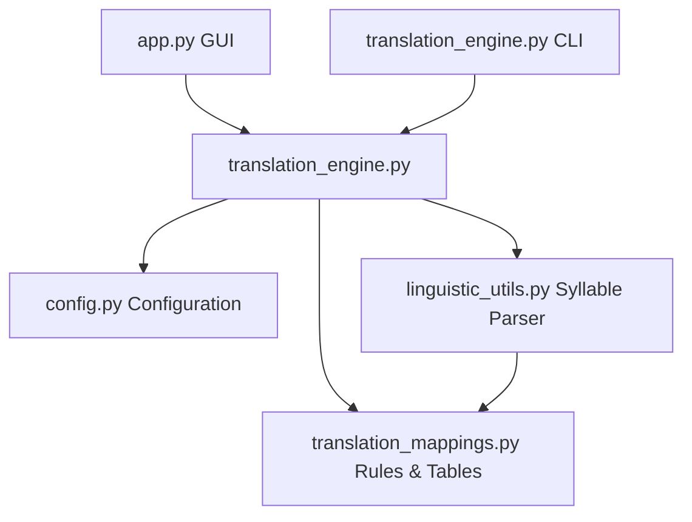

# System Architecture Documentation

This document describes the design principles, structural separation of concerns, and data pipeline of the **Eenadu 4C Lipika Translator**.

---

## Component Layout

The repository utilizes a modular 5-component architecture:



### 1. [app.py](file:///e:/translator/translator/app.py) (User Interface)
- Tkinter GUI written with accessibility, high-DPI scaling, and rich visual cues.
- Handles keyboard shortcuts, auto-save state recovery, and displays translation statistics/speeds.

### 2. [translation_engine.py](file:///e:/translator/translator/translation_engine.py) (Visual Engine & CLI)
- Coordinates forward (Unicode to CP1252 bytes) and reverse (CP1252 bytes to Unicode) translation.
- Controls visual conjunct assembly and provides command-line argument parsing.
- Optimized using import-time pre-sorted reverse lookup cache tables.

### 3. [linguistic_utils.py](file:///e:/translator/translator/linguistic_utils.py) (Telugu Grammatical Parser)
- Breaks Telugu Unicode script into logical syllables using a single-pass finite-state machine.
- Provides CP1252/CP1251 robust encoder mappings.
- Leverages an LRU-cached Levenshtein distance vocabulary list for spelling correction.

### 4. [translation_mappings.py](file:///e:/translator/translator/translation_mappings.py) (Mapping Data Tables)
- Hardcoded consonant, matra, and conjunct mapping definitions.
- Generates dynamic reverse lookups and imports external overrides from `sandbox/`.

### 5. [config.py](file:///e:/translator/translator/config.py) (System settings & Logger)
- Centralized configuration system loading/saving from `sandbox/config.json`.
- Configures thread-safe rotating file handlers saving to `logs/translator.log`.

---

## Data Pipeline Flow

```text
Input Telugu Unicode Text
         ↓
Punctuation & NFC Unicode Normalization
         ↓
Syllable Segmentation (linguistic_utils.segmentize)
         ↓
Visual Assembly Engine (translation_engine.assemble_syllable)
  - Identifies Base Consonants
  - Applies Vowel Sign (Matra) offsets
  - Processes subjoined Vattulu characters
         ↓
Post-processing Mapping substitutions (using rules in translation_mappings.py)
         ↓
Atomic file/clipboard write (cp1252 legacy format)
```
